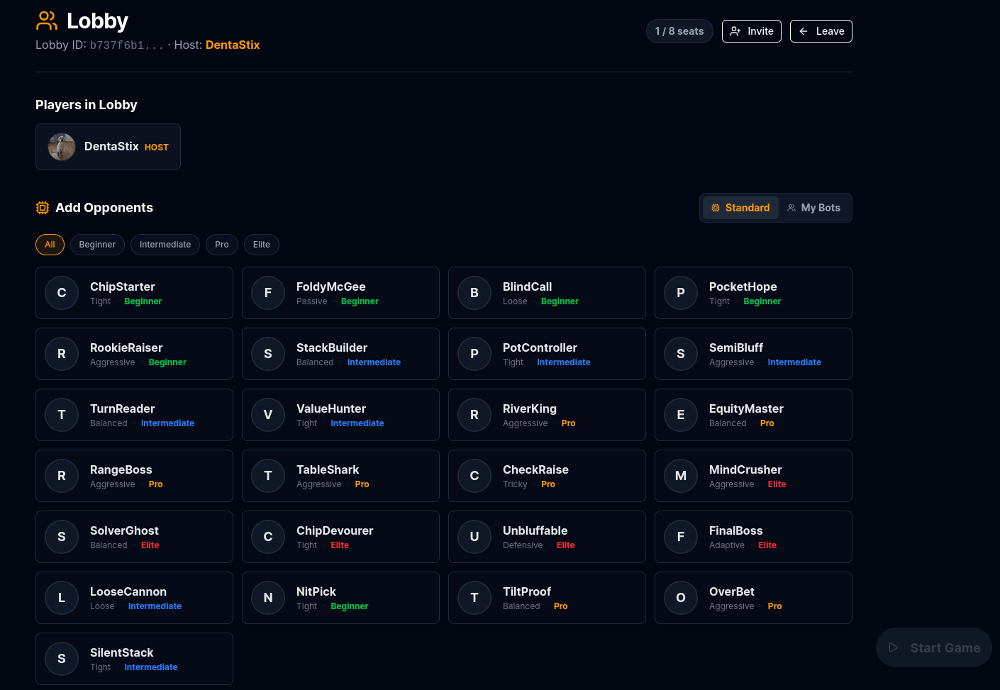
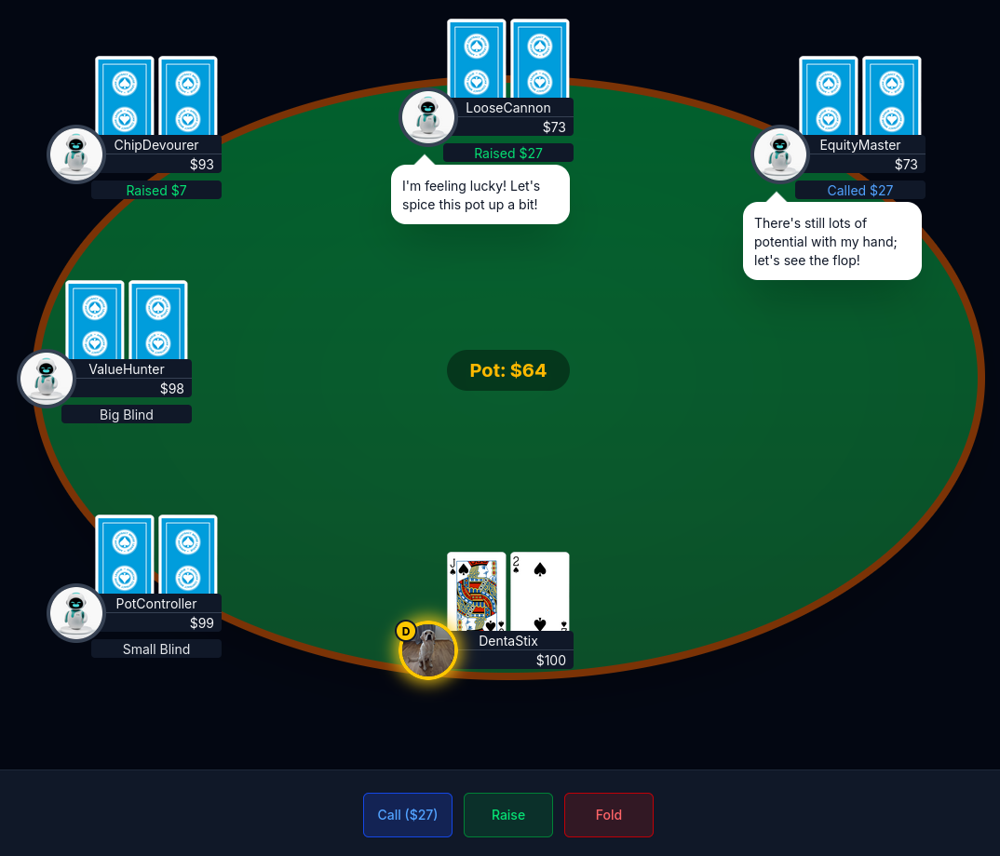
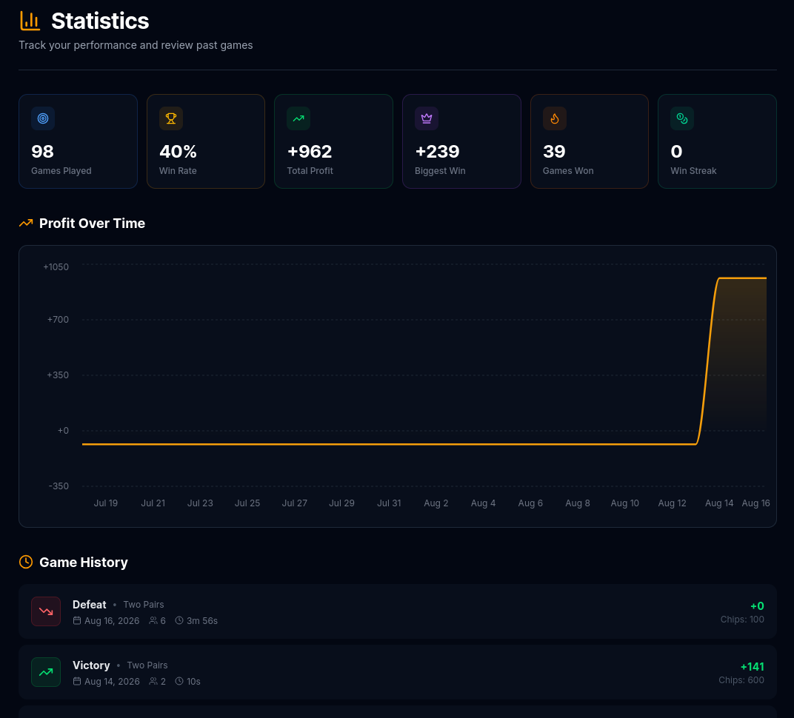

# PokerGame

A full-stack, real-time multiplayer poker web application. Play Texas Hold'em against friends or AI-powered bot opponents, chat in real time, track your stats, and manage your poker profile — all from the browser.

🔗 **Live site:** [https://pokergame.win/](https://pokergame.win/)

## About

PokerGame lets users register an account, join or create poker lobbies, and play real-time poker hands with other players or AI bots powered by OpenAI. The app features a friends system with live notifications, private chat, a bot management system for creating custom AI opponents, and detailed player statistics/game history.

## Screenshots

<!-- TODO: Replace these placeholders with real screenshots. Add your image files to a `docs/screenshots/` folder and update the paths below. -->

| Lobby | Poker Table | Statistics |
|---|---|---|
|  |  |  |

## Features

**Authentication & Profile**
- Register/login with JWT access + refresh tokens
- Daily login bonus system
- Profile image upload (Azure Blob Storage) and account settings

**Poker Gameplay**
- Real-time gameplay via SignalR
- Turn-based actions: fold, check, call, raise
- Card dealing, pot management, multi-player tables

**AI Bots**
- Create, update, and manage custom bots with profile images
- Each bot will play differently based on it's personality including messages that the bot can send mid game
- OpenAI-powered bot decision-making (via Semantic Kernel)

**Lobby & Tables**
- Create/join lobbies, send and respond to lobby invites

**Friends**
- Find and add friends, send/accept/decline friend requests
- Real-time friend notifications

**Chat**
- Private messaging between friends
- Message history and read receipts, delivered in real time

**Statistics & History**
- Win/loss statistics and performance analytics
- Paginated game history

## Tech Stack

**Backend**
- .NET 9 / ASP.NET Core Web API
- Built using Clean Architecture
- Entity Framework Core 9 + Npgsql (PostgreSQL)
- SignalR (real-time hubs)
- ASP.NET Identity + JWT authentication
- OpenAI SDK + Microsoft Semantic Kernel (bot AI)
- Azure Blob Storage (image uploads)
- StackExchange.Redis (game state)
- Serilog, FluentValidation, Mapster

**Frontend**
- React 19 + TypeScript + Vite (React Compiler)
- Zustand (state management)
- Radix UI + Tailwind CSS 4 (ui elements)
- @microsoft/signalr (real-time client)
- React Router v7, Axios, Recharts, Framer Motion

**Infrastructure**
- PostgreSQL & Redis (Docker, Alpine images)
- Nginx (serves the built frontend)
- Docker Compose orchestration

## Project Structure

```
backend/
  Api/             # ASP.NET Core entry point: Controllers, SignalR Hubs, Program.cs
  Application/     # Business logic services & validators
  Core/            # DTOs, domain/game models, interfaces
  Infrastructure/  # EF Core DbContext, migrations, repositories, external services

frontend/
  src/
    pages/         # Route-level views (Home, Login, Dashboard, Game, Lobby, ...)
    components/    # Reusable UI & game components (PlayerSeat, PlayingCard, ...)
    stores/        # Zustand state stores
    hooks/         # Custom React hooks
    context/       # React context providers
```

## Getting Started (Docker)

### Prerequisites
- [Docker](https://www.docker.com/) and Docker Compose

### Setup

1. Clone the repository:
   ```bash
   git clone https://github.com/DennisDahlberg/FullstackPoker.git
   cd poker_fullstack
   ```

2. Copy the example environment file and fill in your own credentials:
   ```bash
   cp .env.example .env
   ```
   At minimum, you'll need to provide your own `OPENAI_API_KEY` and Azure Storage credentials (see [Environment Variables](#environment-variables) below).

3. Build and start all services:
   ```bash
   docker compose up --build
   ```

4. Once the containers are running:
   - Frontend: [http://localhost:8080](http://localhost:8080)
   - Backend API: [http://localhost:5000](http://localhost:5000)

## Environment Variables

Configured via the root `.env` file (see [.env.example](.env.example)):

| Variable | Description | Required |
|---|---|---|
| `POSTGRES_USER` | PostgreSQL username | Default provided |
| `POSTGRES_PASSWORD` | PostgreSQL password | Default provided |
| `POSTGRES_DB` | PostgreSQL database name | Default provided |
| `OPENAI_MODEL` | OpenAI model used for bot AI (e.g. `gpt-4o-mini`) | Default provided |
| `OPENAI_API_KEY` | Your OpenAI API key, used for AI bot decision-making | **Yes** |
| `AZURE_STORAGE_KEY` | Access key for your Azure Storage account | **Yes** |
| `AZURE_STORAGE_ACCOUNT` | Name of your Azure Storage account | **Yes** |
| `AZURE_STORAGE_CONTAINER` | Name of your Azure Blob container (for profile/bot images) | **Yes** |
